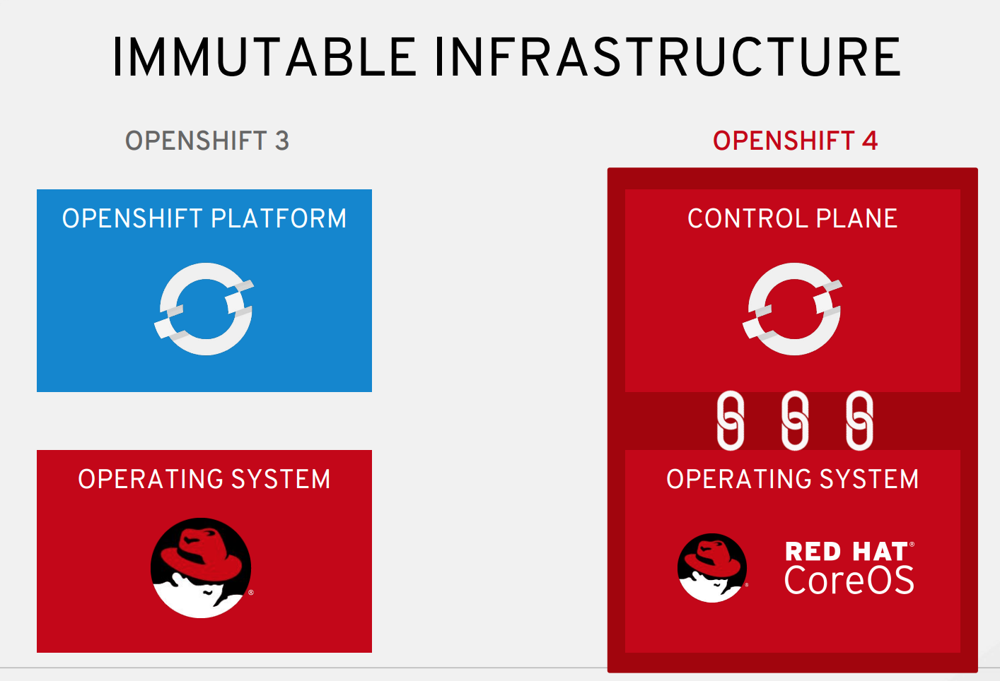
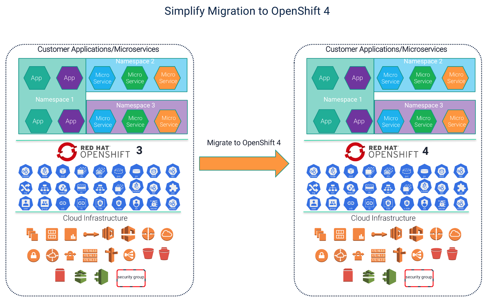
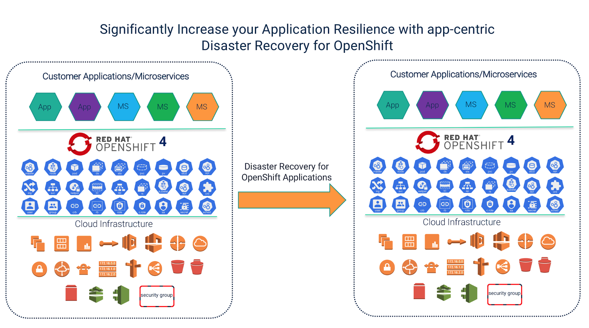
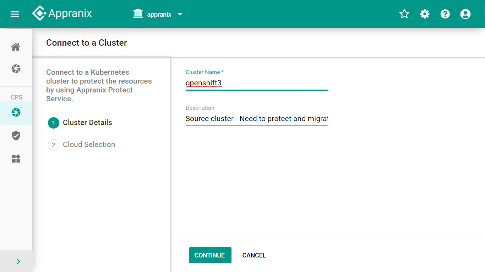
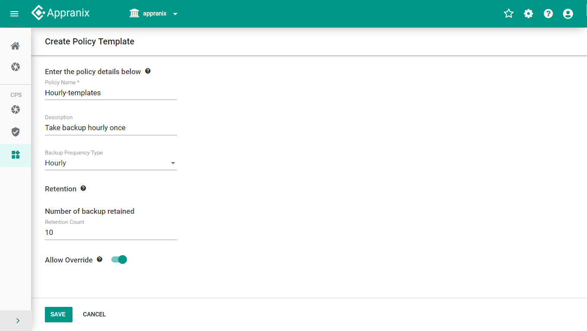
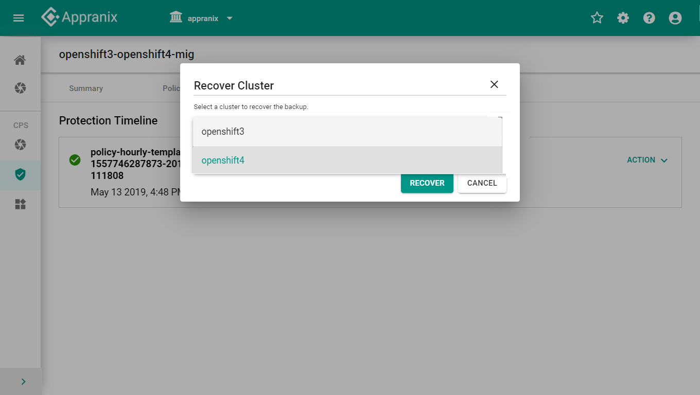

## Simplify Migration from OpenShift 3 to 4

Now that Red Hat OpenShift 4 has been officially announced, it’s time to start thinking about migration from OCP 3 to OCP 4. 

You can check out the details about all the differences between OpenShift 3 and 4 here - 

https://blog.openshift.com/openshift-commons-briefing-openshift-4-0-release-update-with-ali-mobreem/

One of the biggest differences between OpenShift 3 and 4 is how OpenShift 4 clusters operate using immutable and completely automated infrastructure enabled by RHEL CoreOS based operating system and automation. Changing from mutable infrastructure based OpenShift 3 clusters to immutable infrastructure based clusters brings interesting challenges. On the one hand, OpenShift 4 simplifies operations drastically by using the Operators model, but on the other, it makes the migration to this model more time consuming and complex. 

## Using Appranix to Migrate from OpenShift 3 to 4 Clusters

Appranix is a technology and business partner of Red Hat. We worked closely with Red Hat to support the ease of migration of OpenShift 3 cluster resources to Open Shift 4 using a service created on top of our Site Reliability Automation for Kubernetes - www.appranix.com. OpenShift 3 customers can use Appranix’s Site Reliability Automation’s fully automated capabilities to backup and recover all the 3 cluster resources to OpenShift 4 with a few clicks. 

### Advantages of Using Appranix for OpenShift 4 Migration

* Simple to get started with a SaaS-based migration solution. There is no infrastructure to setup. There is no configuration or separate management solution to set up for migration purposes.

* Appranix migration solution is very scalable so large cluster migration will be painless

* All the complex OpenShift 3 cluster configurations are automatically captured and migrated over to OpenShift 4, drastically simplifying operations
* Test your on-prem OpenShift 3 based applications on OpenShift 4 running on AWS 
* Migrate all your RBAC settings along with your cluster resources
* Migrate specific projects or all the projects together to the new OpenShift 4 clusters
* (Optional) 14 day free trial for the full Appranix OpenShift Disaster Recovery solution 

## App-Centric Disaster Recovery for OpenShift Applications             

(Optional - 14 day trial after the migration)

  

Using Appranix platform’s broader capabilities, after migrating your clusters from OpenShift 3 to OpenShift 4, organizations can continue to protect and recover entire applications for chaos engineering, disaster recovery, ransomware protection and business continuity use cases. 

## How to Migrate OpenShift 3 to OpenShift 4 using Appranix Site Reliability Platform
  

  

## Configuring OpenShift 3 and 4 Clusters for Automated Discovery
  

Appranix assumes that customers have OpenShift 3 and 4 clusters running. If you have not created OpenShift 4 clusters, there is good documentation from Red Hat on how to deploy OpenShift 4 quickly - https://blog.openshift.com/installing-openshift-4-from-start-to-finish/. You can configure your primary and target clusters in the same way in Appranix easily with a few steps. 
  

## Install Appranix Controller Agent for Discovering Clusters
  

Discovering cluster resources requires a small sidecar controller agent. This is easy with a cut and paste of a curl command as shown below. Once the agent is installed on OpenShift 3 & 4, all the cluster resources, including namespaces, deployments, pods, services, and host of other resources for the migration will be automatically discovered by Appranix.

  

## Migrate Large Distributed Applications

This section shows how an example distributed microservices application called SockShop can be easily migrated from OpenShift 3 to 4. You can refer to details of the SockShop and how it’s architected with microservices here - https://microservices-demo.github.io/. SockShop’s architecture is made up of multiple components as shown below. 
  

Appranix discovers all the resources, including, PoDs, deployments, services, and all the cluster configurations necessary to protect and migrate to OpenShift 4. 

####OpenShift 3 running SockShop Application

  

  

## Creating Protection Policies for the Migration
  
Users can create flexible policies based on how they want to migrate. You can also have multiple baselines or a single hourly policy.
  

  

## Migrate Mulitple OpenShift 3 Clusters Using Protection Plans 
  
Users can flexibly choose hourly or weekly or even monthly policy depending on application or namespace requirements to apply on OpenShift 3 clusters. 

Appranix allows migration of all the namespaces in a cluster or specific namespaces to OpenShift 4. 

  

## Single Click Migration to OpenShift 4
  
Migration is super simple with a single click recovery of the selected namespaces into the target OpenShift 4 cluster. Appranix takes care of all the necessary work behind to make sure all the cluster configurations and resources are appropriately captured and recovered into OpenShift 4.

  

## Verify Migrated Applications on OpenShift 4

Login to your OpenShift 4 cluster and refresh projects to make sure all the applications and namespaces are proper. Repeat the same process for other namespaces by either creating new protection plans of modifying the existing protection plans. 

  
 
## Running Migrated Applications on OpenShift 4

Once your applications have been migrated using Appranix recovery procedure, configuring your routes to point to the OpenShift 4 is key. It’s quite possible that you might want to do a test recovery before switching over from OpenShift 3 production environment. Once you have your OpenShift 4 running with a few applications in their respective namespaces, you might want to migrate more using the same process shown above. 

Once you have migrated all the namespaces, you can continue to protect your OpenShift 4 clusters for continued disaster recovery, ransomware protection, business continuity or future migration purposes. Appranix Site Reliability Automation will be able to provide a seamless and simple solution that is continuously updated to keep up with the fast Kubernetes and OpenShift releases. 

## Summary
 
OpenShift 4 is a new step forward for the entire industry with immutable architecture and operator framework model to automate many complex configurations of applications and platforms running on the clusters. However, migrating from OpenShift 3 is complex due to the architecture and operations model differences. Appranix gives an easy button to migrate to OpenShift 4 using our proven Site Reliability Platform for app-centric, cloud-native disaster recovery capabilities.
  
## About Appranix

Appranix is the leading Site Reliability Automation company. Our SaaS platform delivers true application resiliency with disaster recovery and self-healing.
  
## Contact Appranix

Email: sales@appranix.com 
Website: www.Appranix.com 
Phone: +1 508-656-0756